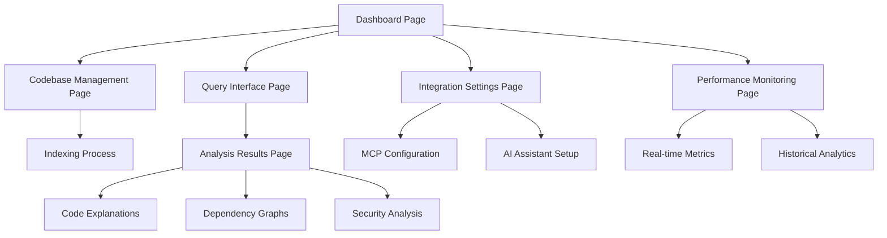

# Product Requirements Document: Code Intelligence MCP Server

## 1. Product Overview

Code Intelligence MCP Server, AI asistanlarının doğal dil sorguları ile kod tabanlarını anlayabilmesini ve sorgulayabilmesini sağlayan yüksek performanslı bir sunucudur. 15+ programlama dilini destekler, 100K+ dosyalı monorepo'ları işleyebilir ve tamamen çevrimdışı çalışabilir.

Sistem, geliştiricilerin büyük kod tabanlarında gezinmesini kolaylaştırır, kod yapısını ve bağımlılıklarını anlamalarına yardımcı olur, ve AI asistanları aracılığıyla akıllı kod analizi sağlar. Model Context Protocol (MCP) üzerinden entegrasyon ile modern geliştirme ortamlarına sorunsuz uyum sağlar.

## 2. Core Features

### 2.1 User Roles

| Role | Registration Method | Core Permissions |
|------|---------------------|------------------|
| Developer | Local installation | Can index codebases, perform queries, access all analysis features |
| Team Lead | Configuration management | Can manage team configurations, set up shared codebases, monitor usage |
| Enterprise Admin | System deployment | Can deploy at scale, configure enterprise features, manage multiple instances |

### 2.2 Feature Module

Our Code Intelligence MCP Server consists of the following main pages:

1. **Dashboard Page**: System status, codebase overview, recent queries, performance metrics
2. **Codebase Management Page**: Add/remove codebases, indexing status, configuration settings
3. **Query Interface Page**: Natural language search, advanced filters, result visualization
4. **Analysis Results Page**: Code explanations, dependency graphs, security findings, complexity metrics
5. **Integration Settings Page**: MCP configuration, AI assistant connections, API endpoints
6. **Performance Monitoring Page**: System metrics, query performance, resource usage

### 2.3 Page Details

| Page Name | Module Name | Feature description |
|-----------|-------------|---------------------|
| Dashboard Page | Status Overview | Display system health, active codebases count, indexing progress, recent query statistics |
| Dashboard Page | Quick Actions | Provide shortcuts for common tasks like adding codebase, running queries, viewing logs |
| Dashboard Page | Performance Summary | Show response times, memory usage, cache hit rates, system alerts |
| Codebase Management Page | Codebase Registry | List all indexed codebases with status, size, last updated, supported languages |
| Codebase Management Page | Indexing Control | Start/stop/pause indexing, configure parallel workers, set exclusion patterns |
| Codebase Management Page | Configuration Manager | Set indexing preferences, storage backend selection, language-specific settings |
| Query Interface Page | Natural Language Search | Accept free-form queries, detect intent, provide search suggestions |
| Query Interface Page | Advanced Filters | Filter by file type, date range, complexity, author, specific directories |
| Query Interface Page | Query History | Store and retrieve previous queries, bookmark useful searches, share query templates |
| Analysis Results Page | Code Explanations | Generate detailed function/class explanations using local or cloud LLMs |
| Analysis Results Page | Dependency Visualization | Display call graphs, import relationships, data flow diagrams |
| Analysis Results Page | Security Analysis | Detect vulnerabilities, highlight security patterns, generate audit reports |
| Analysis Results Page | Complexity Metrics | Calculate cyclomatic complexity, maintainability index, code duplication |
| Integration Settings Page | MCP Configuration | Configure Model Context Protocol settings, tool definitions, authentication |
| Integration Settings Page | AI Assistant Setup | Connect to Claude Desktop, VS Code, custom assistants, test connections |
| Integration Settings Page | API Management | Configure REST endpoints, authentication tokens, rate limiting |
| Performance Monitoring Page | Real-time Metrics | Monitor CPU, memory, disk usage, query throughput, error rates |
| Performance Monitoring Page | Historical Analytics | Track performance trends, identify bottlenecks, capacity planning |
| Performance Monitoring Page | Alert Management | Configure performance thresholds, notification settings, escalation rules |

## 3. Core Process

### Developer Flow
1. **Setup**: Install Code Intelligence MCP Server and configure initial settings
2. **Codebase Addition**: Add local or remote codebases for indexing
3. **Indexing**: Monitor automatic indexing process with progress indicators
4. **Querying**: Use natural language to search and analyze code
5. **Analysis**: Review detailed explanations, metrics, and visualizations
6. **Integration**: Connect with preferred AI assistants and development tools

### AI Assistant Integration Flow
1. **MCP Connection**: AI assistant connects to Code Intelligence server via MCP protocol
2. **Tool Discovery**: Assistant discovers available code intelligence tools
3. **Query Processing**: Assistant translates user requests to appropriate tool calls
4. **Result Interpretation**: Assistant processes and presents results to user
5. **Follow-up Actions**: Assistant can chain multiple tool calls for complex analysis

## 4. User Interface Design

### 4.1 Design Style

- **Primary Colors**: Deep blue (#1e3a8a) for headers and primary actions, light blue (#3b82f6) for accents
- **Secondary Colors**: Gray scale (#f8fafc to #1e293b) for backgrounds and text, green (#10b981) for success states, red (#ef4444) for errors
- **Button Style**: Rounded corners (8px radius), subtle shadows, hover animations with color transitions
- **Font**: Inter for UI text (14px base), JetBrains Mono for code snippets (12px), clear hierarchy with font weights 400-600
- **Layout Style**: Clean card-based design, left sidebar navigation, responsive grid layouts, consistent 16px spacing
- **Icons**: Lucide icons for consistency, code-specific icons for file types, status indicators with color coding

### 4.2 Page Design Overview

| Page Name | Module Name | UI Elements |
|-----------|-------------|-------------|
| Dashboard Page | Status Overview | Cards with metrics, progress bars for indexing, status badges (green/yellow/red), real-time updating counters |
| Dashboard Page | Quick Actions | Large action buttons with icons, recent items list, search bar with autocomplete |
| Codebase Management Page | Codebase Registry | Data table with sorting/filtering, status indicators, action dropdowns, bulk operations toolbar |
| Codebase Management Page | Indexing Control | Progress indicators, start/stop buttons, configuration panels, log viewer with syntax highlighting |
| Query Interface Page | Natural Language Search | Large search input with suggestions, query type selector, recent queries sidebar |
| Query Interface Page | Advanced Filters | Collapsible filter panels, tag-based selections, date pickers, file tree browser |
| Analysis Results Page | Code Explanations | Syntax-highlighted code blocks, expandable sections, copy-to-clipboard buttons |
| Analysis Results Page | Dependency Visualization | Interactive graph with zoom/pan, node details on hover, export options (SVG/PNG) |
| Integration Settings Page | MCP Configuration | Form inputs with validation, connection status indicators, test buttons |
| Performance Monitoring Page | Real-time Metrics | Live updating charts, gauge components, alert notifications, drill-down capabilities |

### 4.3 Responsiveness

The product is desktop-first with mobile-adaptive design. Touch interaction optimization is considered for tablet usage, with responsive breakpoints at 768px (tablet) and 1024px (desktop). Navigation collapses to hamburger menu on mobile, cards stack vertically, and data tables become horizontally scrollable.

## 5. Technical Requirements

### 5.1 Performance Requirements
- Small projects (<1K files): Indexing <5 seconds, queries <50ms
- Medium projects (1K-10K files): Indexing <30 seconds, queries <100ms  
- Large projects (10K-100K files): Indexing <5 minutes, queries <200ms
- Monorepos (>100K files): Indexing <20 minutes, queries <500ms

### 5.2 Scalability Requirements
- Support concurrent indexing of multiple codebases
- Handle up to 100 concurrent query requests
- Scale horizontally with load balancing support
- Efficient memory usage with configurable limits

### 5.3 Security Requirements
- Zero telemetry and external data transmission by default
- Local processing with optional cloud LLM integration
- Secure API authentication with JWT tokens
- Respect .gitignore and security file patterns

### 5.4 Integration Requirements
- Model Context Protocol (MCP) compliance
- REST API for web and mobile clients
- WebSocket support for real-time updates
- Plugin architecture for extensibility

## 6. Success Metrics

### 6.1 Performance Metrics
- Query response time: 95th percentile under target thresholds
- Indexing completion rate: >99% success rate
- System uptime: >99.9% availability
- Memory efficiency: <2GB RAM for typical usage

### 6.2 User Experience Metrics
- Query accuracy: >90% relevant results for natural language queries
- User satisfaction: >4.5/5 rating from developer surveys
- Integration success: <5 minutes setup time for major AI assistants
- Error rate: <1% failed operations

### 6.3 Adoption Metrics
- Active codebases: Track number of regularly queried projects
- Query volume: Monitor daily/weekly query patterns
- Feature usage: Measure adoption of different analysis tools
- Community growth: Track GitHub stars, downloads, contributions

## 7. Constraints and Assumptions

### 7.1 Technical Constraints
- Must operate fully offline without internet dependency
- Support for 15+ programming languages via tree-sitter
- Compatible with Linux, macOS, and Windows
- Minimum system requirements: 4GB RAM, 2GB storage

### 7.2 Business Constraints
- Open source project with permissive licensing
- No mandatory cloud service dependencies
- Privacy-first design with user data control
- Community-driven development model

### 7.3 Assumptions
- Users have basic command-line familiarity
- Development teams use modern AI assistants
- Codebases follow standard project structures
- Users value privacy and local processing

## 8. Future Roadmap

### 8.1 Phase 1 (Current)
- Core indexing and search functionality
- MCP protocol implementation
- Basic AI assistant integrations
- Essential analysis tools

### 8.2 Phase 2 (Next 6 months)
- Advanced visualization features
- Custom plugin development
- Enterprise deployment options
- Performance optimizations

### 8.3 Phase 3 (Future)
- Collaborative features and team workspaces
- Advanced ML models for code understanding
- Integration with more development tools
- Cloud-native deployment options

---

*This Product Requirements Document serves as the foundation for the Code Intelligence MCP Server development and ensures alignment between technical implementation and user needs.*