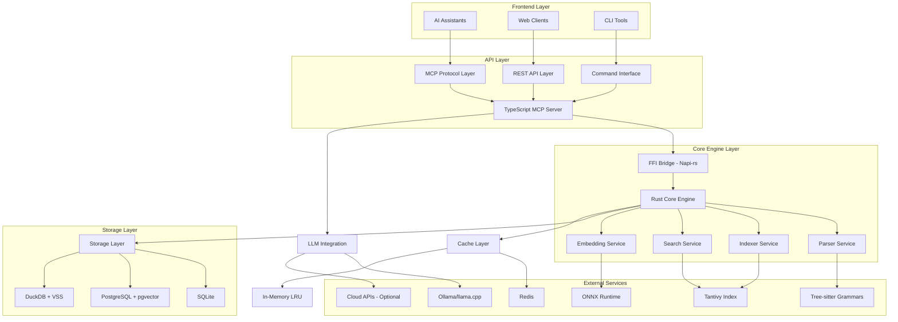
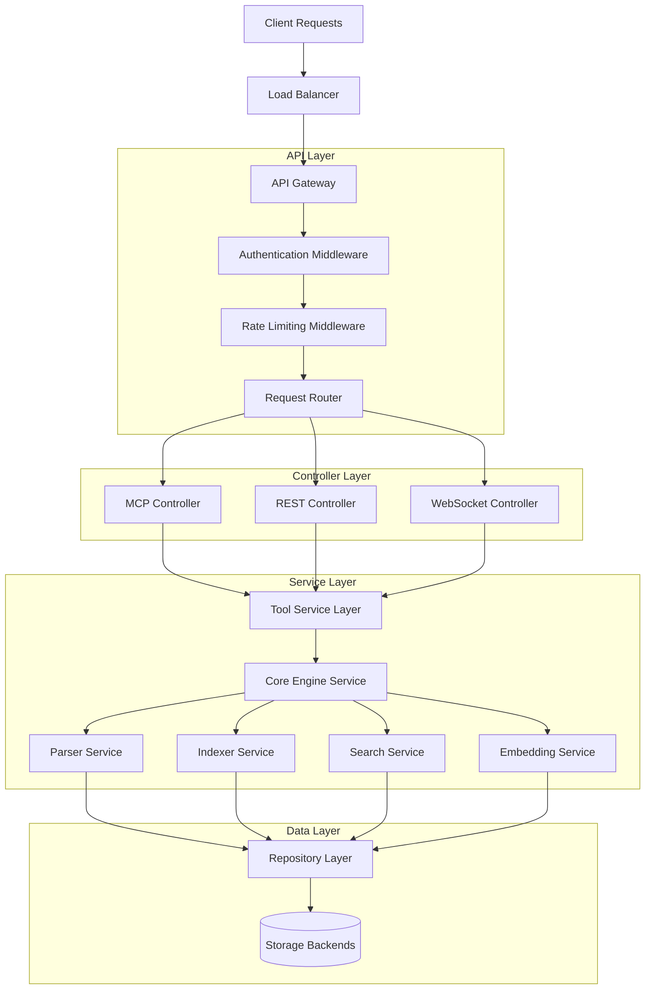
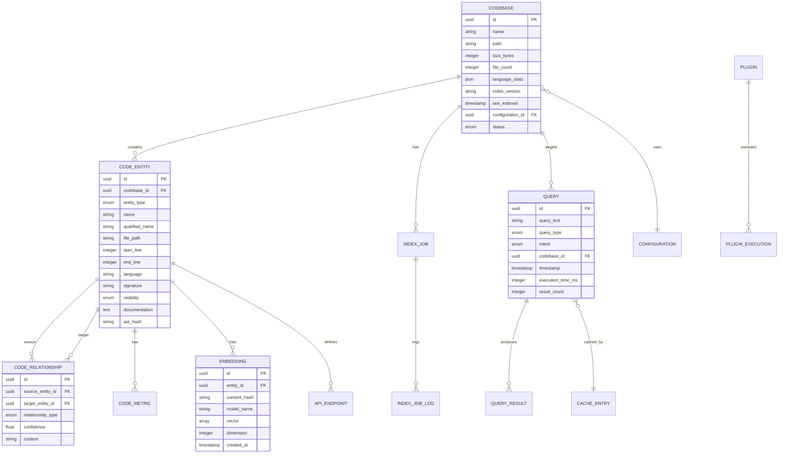

# Technical Architecture Document: Code Intelligence MCP Server

## 1. Architecture Design



## 2. Technology Description

- **Frontend**: Web Dashboard (React@18 + TypeScript + Tailwind CSS + Vite)
- **API Layer**: TypeScript@5.3 + Node.js@20 LTS + Fastify + @modelcontextprotocol/sdk
- **Core Engine**: Rust@1.75+ + Tokio + Rayon + Tree-sitter + Tantivy + ONNX Runtime
- **FFI Bridge**: Napi-rs for Rust-Node.js integration
- **Storage**: SQLite (small), PostgreSQL 16+ with pgvector (enterprise), DuckDB with VSS (analytics)
- **Cache**: Redis (distributed) + In-memory LRU (local)
- **LLM**: Ollama + llama.cpp (local), OpenAI/Anthropic APIs (optional)
- **Testing**: Cargo test + Criterion.rs (Rust), Vitest + Testcontainers (TypeScript)
- **Deployment**: Docker + Kubernetes + GitHub Actions

## 3. Route Definitions

| Route | Purpose |
|-------|---------|
| / | Dashboard page with system overview and quick actions |
| /codebases | Codebase management interface for adding/configuring projects |
| /query | Natural language query interface with advanced filters |
| /analysis/:id | Analysis results page showing code explanations and metrics |
| /integrations | MCP and AI assistant configuration settings |
| /monitoring | Performance monitoring dashboard with real-time metrics |
| /api/health | Health check endpoint for system status |
| /api/metrics | Prometheus metrics endpoint for monitoring |

## 4. API Definitions

### 4.1 Core API

**Codebase Management**
```
POST /api/codebases
```

Request:
| Param Name | Param Type | isRequired | Description |
|------------|------------|------------|-------------|
| name | string | true | Unique name for the codebase |
| path | string | true | Absolute filesystem path to the codebase |
| languages | array<string> | false | Supported programming languages |
| exclude_patterns | array<string> | false | Gitignore-style exclusion patterns |

Response:
| Param Name | Param Type | Description |
|------------|------------|-------------|
| id | string | UUID of the created codebase |
| status | string | Current indexing status |
| created_at | string | ISO timestamp of creation |

Example:
```json
{
  "name": "my-project",
  "path": "/home/user/projects/my-project",
  "languages": ["typescript", "python", "rust"],
  "exclude_patterns": ["node_modules", "*.log", "dist"]
}
```

**Natural Language Query**
```
POST /api/queries
```

Request:
| Param Name | Param Type | isRequired | Description |
|------------|------------|------------|-------------|
| query_text | string | true | Natural language query |
| codebase_id | string | true | UUID of target codebase |
| max_results | integer | false | Maximum number of results (default: 10) |
| include_context | boolean | false | Include surrounding code context |

Response:
| Param Name | Param Type | Description |
|------------|------------|-------------|
| results | array<SearchResult> | Array of matching code entities |
| query_intent | string | Detected query intent |
| execution_time_ms | integer | Query execution time |

**MCP Tool Execution**
```
POST /api/mcp/tools/{tool_name}
```

Request:
| Param Name | Param Type | isRequired | Description |
|------------|------------|------------|-------------|
| arguments | object | true | Tool-specific arguments |
| context | object | false | Additional context information |

Response:
| Param Name | Param Type | Description |
|------------|------------|-------------|
| result | object | Tool execution result |
| metadata | object | Execution metadata and timing |

### 4.2 MCP Protocol Tools

**Available MCP Tools:**
1. `search_code` - Natural language code search
2. `explain_function` - Detailed function analysis
3. `find_references` - Find all references to code entity
4. `trace_data_flow` - Trace data flow through codebase
5. `analyze_security` - Security vulnerability analysis
6. `get_api_endpoints` - Discover REST/GraphQL endpoints
7. `check_complexity` - Code complexity metrics
8. `find_duplicates` - Duplicate code detection
9. `suggest_refactoring` - Refactoring suggestions

## 5. Server Architecture Diagram



## 6. Data Model

### 6.1 Data Model Definition



### 6.2 Data Definition Language

**Codebase Table**
```sql
-- Create codebase table
CREATE TABLE codebases (
    id UUID PRIMARY KEY DEFAULT gen_random_uuid(),
    name VARCHAR(255) UNIQUE NOT NULL,
    path TEXT NOT NULL,
    size_bytes BIGINT DEFAULT 0,
    file_count INTEGER DEFAULT 0,
    language_stats JSONB DEFAULT '{}',
    index_version VARCHAR(50),
    last_indexed TIMESTAMP WITH TIME ZONE,
    configuration_id UUID REFERENCES configurations(id),
    status VARCHAR(20) DEFAULT 'unindexed' CHECK (status IN ('unindexed', 'indexing', 'indexed', 'error')),
    created_at TIMESTAMP WITH TIME ZONE DEFAULT NOW(),
    updated_at TIMESTAMP WITH TIME ZONE DEFAULT NOW()
);

-- Create indexes
CREATE INDEX idx_codebases_status ON codebases(status);
CREATE INDEX idx_codebases_last_indexed ON codebases(last_indexed DESC);
CREATE INDEX idx_codebases_name ON codebases(name);
```

**Code Entity Table**
```sql
-- Create code_entities table
CREATE TABLE code_entities (
    id UUID PRIMARY KEY DEFAULT gen_random_uuid(),
    codebase_id UUID NOT NULL REFERENCES codebases(id) ON DELETE CASCADE,
    entity_type VARCHAR(50) NOT NULL CHECK (entity_type IN ('function', 'class', 'method', 'variable', 'import', 'type', 'interface', 'enum', 'constant')),
    name VARCHAR(255) NOT NULL,
    qualified_name TEXT NOT NULL,
    file_path TEXT NOT NULL,
    start_line INTEGER NOT NULL,
    end_line INTEGER NOT NULL,
    start_column INTEGER DEFAULT 0,
    end_column INTEGER DEFAULT 0,
    language VARCHAR(50) NOT NULL,
    signature TEXT,
    visibility VARCHAR(20) DEFAULT 'public' CHECK (visibility IN ('public', 'private', 'protected', 'internal')),
    documentation TEXT,
    ast_hash VARCHAR(64),
    created_at TIMESTAMP WITH TIME ZONE DEFAULT NOW(),
    updated_at TIMESTAMP WITH TIME ZONE DEFAULT NOW()
);

-- Create indexes
CREATE INDEX idx_code_entities_codebase_id ON code_entities(codebase_id);
CREATE INDEX idx_code_entities_type_name ON code_entities(entity_type, name);
CREATE INDEX idx_code_entities_file_path ON code_entities(file_path);
CREATE INDEX idx_code_entities_qualified_name ON code_entities(qualified_name);
CREATE UNIQUE INDEX idx_code_entities_unique ON code_entities(codebase_id, qualified_name);

-- Full-text search index
CREATE INDEX idx_code_entities_search ON code_entities USING GIN(to_tsvector('english', name || ' ' || COALESCE(documentation, '')));
```

**Embeddings Table**
```sql
-- Create embeddings table
CREATE TABLE embeddings (
    id UUID PRIMARY KEY DEFAULT gen_random_uuid(),
    entity_id UUID REFERENCES code_entities(id) ON DELETE CASCADE,
    content_hash VARCHAR(64) UNIQUE NOT NULL,
    model_name VARCHAR(100) NOT NULL,
    vector REAL[] NOT NULL,
    dimension INTEGER NOT NULL,
    created_at TIMESTAMP WITH TIME ZONE DEFAULT NOW(),
    metadata JSONB DEFAULT '{}'
);

-- Create vector similarity index (requires pgvector extension)
CREATE INDEX idx_embeddings_vector ON embeddings USING ivfflat (vector vector_cosine_ops) WITH (lists = 100);
CREATE INDEX idx_embeddings_content_hash ON embeddings(content_hash);
CREATE INDEX idx_embeddings_model ON embeddings(model_name);
```

**Queries Table**
```sql
-- Create queries table
CREATE TABLE queries (
    id UUID PRIMARY KEY DEFAULT gen_random_uuid(),
    query_text TEXT NOT NULL,
    query_type VARCHAR(50) DEFAULT 'natural_language' CHECK (query_type IN ('natural_language', 'structured', 'regex')),
    intent VARCHAR(50) CHECK (intent IN ('find_function', 'explain_code', 'trace_flow', 'find_usage', 'security_audit', 'find_api', 'check_complexity')),
    codebase_id UUID NOT NULL REFERENCES codebases(id) ON DELETE CASCADE,
    user_id VARCHAR(255),
    timestamp TIMESTAMP WITH TIME ZONE DEFAULT NOW(),
    execution_time_ms INTEGER DEFAULT 0,
    result_count INTEGER DEFAULT 0,
    cache_hit BOOLEAN DEFAULT FALSE
);

-- Create indexes
CREATE INDEX idx_queries_codebase_timestamp ON queries(codebase_id, timestamp DESC);
CREATE INDEX idx_queries_intent ON queries(intent);
CREATE INDEX idx_queries_execution_time ON queries(execution_time_ms);
```

**Initial Data**
```sql
-- Insert default configuration
INSERT INTO configurations (name, profile, indexing_config, search_config, model_config, is_active) VALUES
('default', 'default', 
 '{"parallel_workers": 4, "batch_size": 500, "exclude_patterns": ["node_modules", "*.log", "dist", "build"]}',
 '{"max_results": 50, "context_lines": 3, "fuzzy_threshold": 0.8}',
 '{"embedding_model": "all-MiniLM-L6-v2", "llm_provider": "ollama", "llm_model": "codellama:7b"}',
 true);

-- Insert performance configuration
INSERT INTO configurations (name, profile, indexing_config, search_config, model_config, is_active) VALUES
('performance', 'performance',
 '{"parallel_workers": 8, "batch_size": 1000, "exclude_patterns": ["node_modules", "*.log", "dist", "build", "target"]}',
 '{"max_results": 100, "context_lines": 5, "fuzzy_threshold": 0.7}',
 '{"embedding_model": "all-MiniLM-L6-v2", "llm_provider": "ollama", "llm_model": "codellama:13b"}',
 false);

-- Insert supported languages
INSERT INTO supported_languages (name, tree_sitter_grammar, file_extensions) VALUES
('TypeScript', 'tree-sitter-typescript', ARRAY['.ts', '.tsx']),
('JavaScript', 'tree-sitter-javascript', ARRAY['.js', '.jsx', '.mjs']),
('Python', 'tree-sitter-python', ARRAY['.py', '.pyi']),
('Rust', 'tree-sitter-rust', ARRAY['.rs']),
('Go', 'tree-sitter-go', ARRAY['.go']),
('Java', 'tree-sitter-java', ARRAY['.java']),
('C++', 'tree-sitter-cpp', ARRAY['.cpp', '.cc', '.cxx', '.hpp', '.h']),
('C#', 'tree-sitter-c-sharp', ARRAY['.cs']),
('PHP', 'tree-sitter-php', ARRAY['.php']),
('Ruby', 'tree-sitter-ruby', ARRAY['.rb']),
('Swift', 'tree-sitter-swift', ARRAY['.swift']),
('Kotlin', 'tree-sitter-kotlin', ARRAY['.kt', '.kts']),
('Scala', 'tree-sitter-scala', ARRAY['.scala', '.sc']),
('Dart', 'tree-sitter-dart', ARRAY['.dart']),
('Elixir', 'tree-sitter-elixir', ARRAY['.ex', '.exs']);
```

## 7. Performance Considerations

### 7.1 Indexing Performance
- **Parallel Processing**: Utilize all CPU cores for file parsing
- **Incremental Updates**: Only re-index changed files
- **Memory Management**: Stream processing for large files
- **Batch Operations**: Group database operations for efficiency

### 7.2 Query Performance
- **Multi-tier Search**: Keyword → AST → Semantic → LLM
- **Caching Strategy**: LRU cache for frequent queries
- **Index Optimization**: Covering indexes for common access patterns
- **Connection Pooling**: Efficient database connection management

### 7.3 Scalability
- **Horizontal Scaling**: Load balancer with multiple instances
- **Database Sharding**: Partition by codebase for large deployments
- **CDN Integration**: Static asset delivery optimization
- **Microservice Architecture**: Separate concerns for independent scaling

---

*This technical architecture document provides the foundation for implementing a robust, scalable, and performant Code Intelligence MCP Server that meets all constitutional requirements while delivering exceptional user experience.*