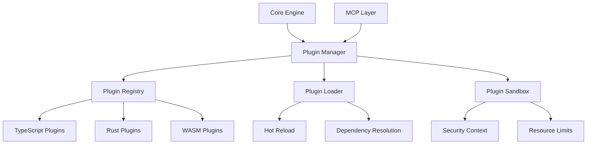

# Plugin Development Guide

The Code Intelligence MCP Server supports a powerful plugin architecture that allows developers to extend functionality, add custom analyzers, and integrate with external tools. This guide covers everything you need to know to develop, test, and deploy plugins.

## Overview

Plugins in the Code Intelligence MCP Server are:

- **Language-agnostic**: Written in TypeScript or Rust
- **Hot-reloadable**: Can be updated without server restart
- **Sandboxed**: Run in isolated environments for security
- **Event-driven**: React to indexing, search, and analysis events
- **Configurable**: Support custom configuration and settings

## Plugin Architecture



## Plugin Types

### 1. Analyzer Plugins

Extend code analysis capabilities:

```typescript
export interface AnalyzerPlugin {
  name: string;
  version: string;
  supportedLanguages: string[];
  
  analyze(context: AnalysisContext): Promise<AnalysisResult>;
  configure(config: PluginConfig): void;
}

example:
- Security vulnerability scanners
- Code quality analyzers
- Performance profilers
- Documentation generators
```

### 2. Search Plugins

Customize search behavior and ranking:

```typescript
export interface SearchPlugin {
  name: string;
  priority: number;
  
  processQuery(query: SearchQuery): Promise<SearchQuery>;
  rankResults(results: SearchResult[]): Promise<SearchResult[]>;
  addFilters(filters: SearchFilter[]): SearchFilter[];
}

Examples:
- Custom ranking algorithms
- Domain-specific search filters
- Result post-processing
- Search analytics
```

### 3. Integration Plugins

Connect with external tools and services:

```typescript
export interface IntegrationPlugin {
  name: string;
  endpoints: string[];
  
  handleWebhook(event: WebhookEvent): Promise<void>;
  syncData(syncRequest: SyncRequest): Promise<SyncResult>;
  authenticate(credentials: Credentials): Promise<AuthResult>;
}

Examples:
- Git repository integration
- Issue tracker synchronization
- CI/CD pipeline integration
- Slack/Teams notifications
```

### 4. UI Plugins

Extend the web interface and dashboards:

```typescript
export interface UIPlugin {
  name: string;
  routes: RouteDefinition[];
  components: ComponentDefinition[];
  
  render(context: RenderContext): Promise<ReactElement>;
  handleAction(action: UIAction): Promise<void>;
}

Examples:
- Custom dashboards
- Visualization components
- Interactive code browsers
- Configuration panels
```

## Getting Started

### Prerequisites

- Node.js 18+ or Rust 1.70+
- Code Intelligence MCP Server SDK
- TypeScript 5.0+ (for TypeScript plugins)
- Basic understanding of the MCP protocol

### Development Environment Setup

```bash
# Install the plugin SDK
npm install -g @code-intelligence/plugin-sdk

# Create a new plugin project
code-intel-plugin create my-analyzer-plugin --type analyzer

# Navigate to the plugin directory
cd my-analyzer-plugin

# Install dependencies
npm install

# Start development mode
npm run dev
```

### Project Structure

```
my-analyzer-plugin/
├── src/
│   ├── index.ts              # Main plugin entry point
│   ├── analyzer.ts           # Core analysis logic
│   ├── config.ts             # Configuration schema
│   └── types.ts              # Type definitions
├── tests/
│   ├── analyzer.test.ts      # Unit tests
│   └── integration.test.ts   # Integration tests
├── examples/
│   ├── basic-usage.ts        # Usage examples
│   └── advanced-config.ts    # Advanced configuration
├── docs/
│   ├── README.md             # Plugin documentation
│   └── API.md                # API reference
├── package.json              # Package configuration
├── plugin.config.json        # Plugin metadata
└── tsconfig.json             # TypeScript configuration
```

## Creating Your First Plugin

### 1. Basic Analyzer Plugin

```typescript
// src/index.ts
import { AnalyzerPlugin, AnalysisContext, AnalysisResult } from '@code-intelligence/plugin-sdk';

export class SecurityAnalyzerPlugin implements AnalyzerPlugin {
  name = 'security-analyzer';
  version = '1.0.0';
  supportedLanguages = ['typescript', 'javascript', 'python'];
  
  private config: SecurityConfig = {
    enableSQLInjectionCheck: true,
    enableXSSCheck: true,
    enableCSRFCheck: true,
    severity: 'medium'
  };
  
  async analyze(context: AnalysisContext): Promise<AnalysisResult> {
    const { fileContent, filePath, language, syntaxTree } = context;
    const issues: SecurityIssue[] = [];
    
    // SQL Injection detection
    if (this.config.enableSQLInjectionCheck) {
      issues.push(...this.detectSQLInjection(syntaxTree, fileContent));
    }
    
    // XSS detection
    if (this.config.enableXSSCheck) {
      issues.push(...this.detectXSS(syntaxTree, fileContent));
    }
    
    // CSRF detection
    if (this.config.enableCSRFCheck) {
      issues.push(...this.detectCSRF(syntaxTree, fileContent));
    }
    
    return {
      pluginName: this.name,
      filePath,
      issues: issues.map(issue => ({
        type: 'security',
        severity: issue.severity,
        message: issue.message,
        line: issue.line,
        column: issue.column,
        rule: issue.rule,
        suggestion: issue.suggestion
      })),
      metrics: {
        analysisTime: Date.now() - context.startTime,
        linesAnalyzed: fileContent.split('\n').length,
        issuesFound: issues.length
      }
    };
  }
  
  configure(config: PluginConfig): void {
    this.config = { ...this.config, ...config };
  }
  
  private detectSQLInjection(tree: SyntaxTree, content: string): SecurityIssue[] {
    const issues: SecurityIssue[] = [];
    
    // Query for string concatenation patterns that might be SQL injection
    const query = `
      (binary_expression
        left: (string) @left
        operator: "+"
        right: (identifier) @right) @concat
    `;
    
    const matches = tree.query(query);
    
    for (const match of matches) {
      const leftNode = match.captures.find(c => c.name === 'left');
      const rightNode = match.captures.find(c => c.name === 'right');
      
      if (leftNode && rightNode) {
        const leftText = content.slice(leftNode.startIndex, leftNode.endIndex);
        
        // Check if left side looks like SQL
        if (this.looksLikeSQL(leftText)) {
          issues.push({
            rule: 'sql-injection',
            severity: 'high',
            message: 'Potential SQL injection vulnerability detected',
            line: leftNode.startPosition.row + 1,
            column: leftNode.startPosition.column + 1,
            suggestion: 'Use parameterized queries or prepared statements'
          });
        }
      }
    }
    
    return issues;
  }
  
  private detectXSS(tree: SyntaxTree, content: string): SecurityIssue[] {
    // Implementation for XSS detection
    return [];
  }
  
  private detectCSRF(tree: SyntaxTree, content: string): SecurityIssue[] {
    // Implementation for CSRF detection
    return [];
  }
  
  private looksLikeSQL(text: string): boolean {
    const sqlKeywords = ['SELECT', 'INSERT', 'UPDATE', 'DELETE', 'FROM', 'WHERE'];
    const upperText = text.toUpperCase();
    return sqlKeywords.some(keyword => upperText.includes(keyword));
  }
}

// Plugin configuration schema
interface SecurityConfig {
  enableSQLInjectionCheck: boolean;
  enableXSSCheck: boolean;
  enableCSRFCheck: boolean;
  severity: 'low' | 'medium' | 'high';
}

interface SecurityIssue {
  rule: string;
  severity: 'low' | 'medium' | 'high';
  message: string;
  line: number;
  column: number;
  suggestion: string;
}

// Export the plugin
export default SecurityAnalyzerPlugin;
```

### 2. Plugin Configuration

```json
// plugin.config.json
{
  "name": "security-analyzer",
  "version": "1.0.0",
  "description": "Security vulnerability analyzer for code intelligence",
  "author": "Your Name <your.email@example.com>",
  "license": "MIT",
  "type": "analyzer",
  "main": "dist/index.js",
  "supportedLanguages": ["typescript", "javascript", "python"],
  "dependencies": {
    "@code-intelligence/plugin-sdk": "^1.0.0"
  },
  "configuration": {
    "schema": {
      "type": "object",
      "properties": {
        "enableSQLInjectionCheck": {
          "type": "boolean",
          "default": true,
          "description": "Enable SQL injection vulnerability detection"
        },
        "enableXSSCheck": {
          "type": "boolean",
          "default": true,
          "description": "Enable XSS vulnerability detection"
        },
        "enableCSRFCheck": {
          "type": "boolean",
          "default": true,
          "description": "Enable CSRF vulnerability detection"
        },
        "severity": {
          "type": "string",
          "enum": ["low", "medium", "high"],
          "default": "medium",
          "description": "Minimum severity level to report"
        }
      }
    }
  },
  "permissions": {
    "fileSystem": ["read"],
    "network": [],
    "system": []
  },
  "resources": {
    "maxMemory": "256MB",
    "maxCPU": "50%",
    "timeout": "30s"
  }
}
```

### 3. Testing Your Plugin

```typescript
// tests/analyzer.test.ts
import { SecurityAnalyzerPlugin } from '../src/index';
import { createMockAnalysisContext } from '@code-intelligence/plugin-sdk/testing';

describe('SecurityAnalyzerPlugin', () => {
  let plugin: SecurityAnalyzerPlugin;
  
  beforeEach(() => {
    plugin = new SecurityAnalyzerPlugin();
  });
  
  describe('SQL Injection Detection', () => {
    it('should detect potential SQL injection', async () => {
      const context = createMockAnalysisContext({
        fileContent: `
          const query = "SELECT * FROM users WHERE id = " + userId;
          db.execute(query);
        `,
        language: 'typescript',
        filePath: 'test.ts'
      });
      
      const result = await plugin.analyze(context);
      
      expect(result.issues).toHaveLength(1);
      expect(result.issues[0].rule).toBe('sql-injection');
      expect(result.issues[0].severity).toBe('high');
    });
    
    it('should not flag safe parameterized queries', async () => {
      const context = createMockAnalysisContext({
        fileContent: `
          const query = "SELECT * FROM users WHERE id = ?";
          db.execute(query, [userId]);
        `,
        language: 'typescript',
        filePath: 'test.ts'
      });
      
      const result = await plugin.analyze(context);
      
      expect(result.issues).toHaveLength(0);
    });
  });
  
  describe('Configuration', () => {
    it('should respect configuration settings', () => {
      plugin.configure({
        enableSQLInjectionCheck: false,
        severity: 'high'
      });
      
      // Test that SQL injection check is disabled
      // and severity is set to high
    });
  });
});
```

## Advanced Plugin Development

### 1. Rust Plugin Example

```rust
// src/lib.rs
use code_intelligence_plugin_sdk::{
    AnalyzerPlugin, AnalysisContext, AnalysisResult, PluginConfig
};
use serde::{Deserialize, Serialize};
use tree_sitter::{Language, Parser, Query, QueryCursor};

#[derive(Debug, Serialize, Deserialize)]
pub struct PerformanceAnalyzerPlugin {
    name: String,
    version: String,
    supported_languages: Vec<String>,
    config: PerformanceConfig,
}

#[derive(Debug, Serialize, Deserialize)]
struct PerformanceConfig {
    max_complexity_threshold: u32,
    max_function_length: u32,
    enable_memory_analysis: bool,
    enable_cpu_analysis: bool,
}

impl Default for PerformanceConfig {
    fn default() -> Self {
        Self {
            max_complexity_threshold: 10,
            max_function_length: 50,
            enable_memory_analysis: true,
            enable_cpu_analysis: true,
        }
    }
}

impl AnalyzerPlugin for PerformanceAnalyzerPlugin {
    fn name(&self) -> &str {
        &self.name
    }
    
    fn version(&self) -> &str {
        &self.version
    }
    
    fn supported_languages(&self) -> &[String] {
        &self.supported_languages
    }
    
    async fn analyze(&self, context: &AnalysisContext) -> Result<AnalysisResult, PluginError> {
        let mut issues = Vec::new();
        
        // Analyze cyclomatic complexity
        if let Some(complexity_issues) = self.analyze_complexity(context)? {
            issues.extend(complexity_issues);
        }
        
        // Analyze function length
        if let Some(length_issues) = self.analyze_function_length(context)? {
            issues.extend(length_issues);
        }
        
        // Analyze memory usage patterns
        if self.config.enable_memory_analysis {
            if let Some(memory_issues) = self.analyze_memory_patterns(context)? {
                issues.extend(memory_issues);
            }
        }
        
        Ok(AnalysisResult {
            plugin_name: self.name.clone(),
            file_path: context.file_path.clone(),
            issues,
            metrics: AnalysisMetrics {
                analysis_time: context.start_time.elapsed(),
                lines_analyzed: context.file_content.lines().count(),
                issues_found: issues.len(),
            },
        })
    }
    
    fn configure(&mut self, config: &PluginConfig) -> Result<(), PluginError> {
        if let Some(threshold) = config.get("max_complexity_threshold") {
            self.config.max_complexity_threshold = threshold.as_u64().unwrap_or(10) as u32;
        }
        
        if let Some(length) = config.get("max_function_length") {
            self.config.max_function_length = length.as_u64().unwrap_or(50) as u32;
        }
        
        Ok(())
    }
}

impl PerformanceAnalyzerPlugin {
    pub fn new() -> Self {
        Self {
            name: "performance-analyzer".to_string(),
            version: "1.0.0".to_string(),
            supported_languages: vec![
                "rust".to_string(),
                "typescript".to_string(),
                "python".to_string(),
            ],
            config: PerformanceConfig::default(),
        }
    }
    
    fn analyze_complexity(&self, context: &AnalysisContext) -> Result<Option<Vec<Issue>>, PluginError> {
        let mut issues = Vec::new();
        
        // Use Tree-sitter to analyze cyclomatic complexity
        let language = self.get_language_for_file(&context.file_path)?;
        let mut parser = Parser::new();
        parser.set_language(language)?;
        
        let tree = parser.parse(&context.file_content, None)
            .ok_or(PluginError::ParseError("Failed to parse file".to_string()))?;
        
        // Query for function definitions
        let query = Query::new(language, r#"
            (function_item
              name: (identifier) @function.name
              body: (block) @function.body)
        "#)?;
        
        let mut cursor = QueryCursor::new();
        let matches = cursor.matches(&query, tree.root_node(), context.file_content.as_bytes());
        
        for match_ in matches {
            for capture in match_.captures {
                if capture.index == 1 { // function.body
                    let complexity = self.calculate_cyclomatic_complexity(capture.node, &context.file_content);
                    
                    if complexity > self.config.max_complexity_threshold {
                        issues.push(Issue {
                            rule: "high-complexity".to_string(),
                            severity: Severity::Warning,
                            message: format!("Function has high cyclomatic complexity: {}", complexity),
                            line: capture.node.start_position().row + 1,
                            column: capture.node.start_position().column + 1,
                            suggestion: "Consider breaking this function into smaller functions".to_string(),
                        });
                    }
                }
            }
        }
        
        Ok(if issues.is_empty() { None } else { Some(issues) })
    }
    
    fn calculate_cyclomatic_complexity(&self, node: tree_sitter::Node, source: &str) -> u32 {
        let mut complexity = 1; // Base complexity
        
        let mut cursor = node.walk();
        
        fn visit_node(cursor: &mut tree_sitter::TreeCursor, complexity: &mut u32) {
            let node = cursor.node();
            
            match node.kind() {
                "if_expression" | "while_expression" | "for_expression" | 
                "match_expression" | "loop_expression" => {
                    *complexity += 1;
                }
                _ => {}
            }
            
            if cursor.goto_first_child() {
                loop {
                    visit_node(cursor, complexity);
                    if !cursor.goto_next_sibling() {
                        break;
                    }
                }
                cursor.goto_parent();
            }
        }
        
        visit_node(&mut cursor, &mut complexity);
        complexity
    }
}

// Export the plugin for dynamic loading
#[no_mangle]
pub extern "C" fn create_plugin() -> *mut dyn AnalyzerPlugin {
    Box::into_raw(Box::new(PerformanceAnalyzerPlugin::new()))
}
```

### 2. Plugin SDK API Reference

```typescript
// Core interfaces
export interface AnalysisContext {
  fileContent: string;
  filePath: string;
  language: string;
  syntaxTree: SyntaxTree;
  startTime: number;
  metadata: FileMetadata;
}

export interface AnalysisResult {
  pluginName: string;
  filePath: string;
  issues: Issue[];
  metrics: AnalysisMetrics;
  suggestions?: Suggestion[];
  dependencies?: Dependency[];
}

export interface Issue {
  type: string;
  severity: 'info' | 'warning' | 'error';
  message: string;
  line: number;
  column: number;
  rule: string;
  suggestion?: string;
  codeSnippet?: string;
}

// Plugin lifecycle hooks
export interface PluginLifecycle {
  onLoad?(): Promise<void>;
  onUnload?(): Promise<void>;
  onConfigChange?(config: PluginConfig): Promise<void>;
  onFileChange?(event: FileChangeEvent): Promise<void>;
}

// Event system
export interface EventEmitter {
  on(event: string, listener: Function): void;
  emit(event: string, ...args: any[]): void;
  off(event: string, listener: Function): void;
}

// Utility functions
export class PluginUtils {
  static async readFile(path: string): Promise<string>;
  static async writeFile(path: string, content: string): Promise<void>;
  static async executeCommand(command: string, args: string[]): Promise<string>;
  static createLogger(pluginName: string): Logger;
  static validateConfig(config: any, schema: JSONSchema): boolean;
}
```

## Plugin Distribution

### 1. Publishing to Plugin Registry

```bash
# Build the plugin
npm run build

# Run tests
npm test

# Package the plugin
npm run package

# Publish to registry
code-intel-plugin publish
```

### 2. Plugin Manifest

```json
// manifest.json
{
  "name": "security-analyzer",
  "version": "1.0.0",
  "description": "Security vulnerability analyzer",
  "author": "Your Name",
  "license": "MIT",
  "homepage": "https://github.com/your-org/security-analyzer-plugin",
  "repository": {
    "type": "git",
    "url": "https://github.com/your-org/security-analyzer-plugin.git"
  },
  "keywords": ["security", "analyzer", "vulnerability"],
  "compatibility": {
    "serverVersion": ">=1.0.0",
    "nodeVersion": ">=18.0.0"
  },
  "files": [
    "dist/**/*",
    "README.md",
    "LICENSE"
  ]
}
```

### 3. Installation

```bash
# Install from registry
code-intel-plugin install security-analyzer

# Install from local file
code-intel-plugin install ./security-analyzer-1.0.0.tgz

# Install from git repository
code-intel-plugin install git+https://github.com/your-org/security-analyzer-plugin.git
```

## Best Practices

### 1. Performance

- **Async Operations**: Use async/await for I/O operations
- **Streaming**: Process large files in chunks
- **Caching**: Cache expensive computations
- **Resource Limits**: Respect memory and CPU limits
- **Early Exit**: Return early when possible

### 2. Security

- **Input Validation**: Validate all inputs
- **Sandboxing**: Run in restricted environment
- **Permissions**: Request minimal permissions
- **Secrets**: Never log sensitive information
- **Dependencies**: Keep dependencies up to date

### 3. Error Handling

```typescript
try {
  const result = await riskyOperation();
  return result;
} catch (error) {
  // Log error with context
  this.logger.error('Operation failed', {
    error: error.message,
    stack: error.stack,
    context: { filePath, operation: 'analyze' }
  });
  
  // Return graceful failure
  return {
    success: false,
    error: 'Analysis failed due to internal error',
    partialResults: []
  };
}
```

### 4. Testing

- **Unit Tests**: Test individual functions
- **Integration Tests**: Test plugin integration
- **Performance Tests**: Measure performance impact
- **Security Tests**: Test security boundaries
- **Compatibility Tests**: Test with different server versions

## Debugging

### 1. Development Mode

```bash
# Start server in development mode
code-intel serve --dev --plugin-debug

# Enable plugin hot reload
code-intel serve --hot-reload

# View plugin logs
code-intel logs --plugin security-analyzer
```

### 2. Debugging Tools

```typescript
// Enable debug logging
const logger = PluginUtils.createLogger('security-analyzer');
logger.setLevel('debug');

// Performance profiling
const profiler = PluginUtils.createProfiler();
profiler.start('analysis');
// ... analysis code ...
const metrics = profiler.end('analysis');
logger.debug('Analysis metrics', metrics);

// Memory monitoring
const memoryUsage = process.memoryUsage();
logger.debug('Memory usage', memoryUsage);
```

## Examples Repository

Find complete plugin examples in our repository:

- [Security Analyzer](https://github.com/code-intelligence/plugins/tree/main/security-analyzer)
- [Performance Profiler](https://github.com/code-intelligence/plugins/tree/main/performance-profiler)
- [Git Integration](https://github.com/code-intelligence/plugins/tree/main/git-integration)
- [Custom Dashboard](https://github.com/code-intelligence/plugins/tree/main/custom-dashboard)

## Community

- **Plugin Registry**: [plugins.code-intelligence.dev](https://plugins.code-intelligence.dev)
- **Documentation**: [docs.code-intelligence.dev/plugins](https://docs.code-intelligence.dev/plugins)
- **Discord**: [discord.gg/code-intelligence](https://discord.gg/code-intelligence)
- **GitHub**: [github.com/code-intelligence/plugins](https://github.com/code-intelligence/plugins)

## Support

Need help with plugin development?

- 📖 [Plugin API Reference](api-reference)
- 💬 [Community Discord](https://discord.gg/code-intelligence)
- 🐛 [Report Issues](https://github.com/code-intelligence/mcp-server/issues)
- 📧 [Email Support](mailto:plugins@code-intelligence.dev)

---

**Ready to build your first plugin?** Start with our [Plugin Template](https://github.com/code-intelligence/plugin-template) and join the community!
