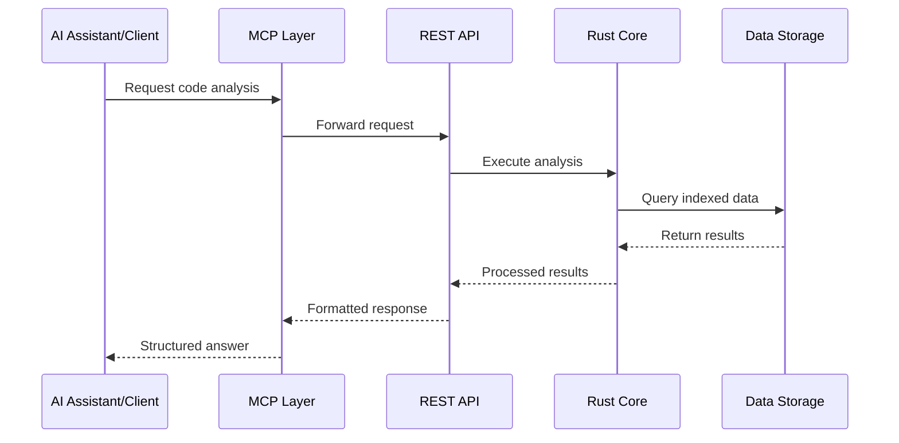

# Introduction

Welcome to the Code Intelligence MCP Server! This is a **working TypeScript implementation** that enables AI assistants to understand and query codebases through natural language, with real SQLite database integration and full Claude Desktop support.

## What's Working Now (v0.1.0)?

The current implementation provides:

- **✅ Real Code Indexing**: SQLite database with 377+ entities from JavaScript/TypeScript projects
- **✅ Natural Language Search**: Query intent detection with database results
- **✅ Claude Desktop Integration**: Tested and verified MCP protocol compliance
- **✅ CLI Tools**: Working `index`, `search`, and `stats` commands
- **✅ Performance**: 47 files indexed in 2-3 seconds, 50-100ms search responses

## Current Architecture

### ✅ **TypeScript MCP Server** (Working)
Complete MCP protocol implementation:
- **9 MCP Tools**: 2 fully functional with real database, 7 with mock responses
- **IndexingService**: Native TypeScript with SQLite database integration
- **CLI Interface**: Working `index`, `search`, `stats` commands
- **Claude Desktop**: Tested integration with stdio transport

### ✅ **Database Layer** (Working)
Real SQLite storage:
- **Entity Storage**: Functions, classes, interfaces, types
- **Search Engine**: Query intent detection and relevance scoring
- **Performance**: Fast queries on 377+ indexed entities
- **File Tracking**: Monitors 47+ files with incremental updates

### 🚧 **Rust Core Engine** (Planned)
Future high-performance layer:
- **Tree-sitter Integration**: Multi-language parsing
- **FFI Bridge**: Napi-rs TypeScript-Rust communication
- **Tantivy Search**: Advanced full-text search capabilities

## How It Works



### The Analysis Pipeline

1. **Code Ingestion**: Your codebase is scanned and parsed
2. **Syntax Analysis**: Tree-sitter extracts structural information
3. **Semantic Processing**: Code entities and relationships are identified
4. **Embedding Generation**: Vector representations for semantic search
5. **Index Storage**: Optimized storage for fast retrieval
6. **Query Processing**: Real-time search and analysis requests

## Supported Languages (Current Implementation)

| Language | Parsing | Entity Extraction | Search Support |
|----------|---------|-------------------|-----------------|
| TypeScript | ✅ | ✅ | ✅ |
| JavaScript | ✅ | ✅ | ✅ |

**Planned with Rust Core:**
- Python, Rust, Java, C++, Go, C#, PHP, Ruby (via Tree-sitter)

*Current implementation focuses on JavaScript/TypeScript with native parsing.*

## Key Benefits

### For Developers
- **Faster Code Discovery**: Find relevant code instantly with natural language
- **Better Understanding**: Get explanations of complex code patterns
- **Quality Insights**: Identify potential issues and improvements
- **Refactoring Support**: Understand dependencies before making changes

### For Teams
- **Knowledge Sharing**: Onboard new team members faster
- **Code Standards**: Maintain consistency across the codebase
- **Technical Debt**: Track and manage code quality over time
- **Documentation**: Auto-generate insights about code architecture

### For Organizations
- **Security Auditing**: Identify potential vulnerabilities
- **Compliance**: Ensure coding standards and best practices
- **Productivity**: Reduce time spent on code exploration
- **Quality Metrics**: Measure and improve code quality

## Use Case Examples

### 🔍 **Code Discovery**
```
Query: "Find all functions that handle user authentication"
Result: Semantic search returns relevant auth functions with context
```

### 🛡️ **Security Analysis**
```
Query: "Check for potential SQL injection vulnerabilities"
Result: Identifies risky database query patterns
```

### 📊 **Code Quality**
```
Query: "Show me the most complex functions in the codebase"
Result: Complexity analysis with refactoring suggestions
```

### 🔄 **Refactoring Support**
```
Query: "What would break if I change this function signature?"
Result: Impact analysis showing all affected code
```

## Integration Ecosystem

The Code Intelligence MCP Server integrates with your existing development workflow:

- **🤖 AI Assistants**: Claude Desktop, ChatGPT, and other MCP-compatible tools
- **📝 IDEs**: VS Code extension for in-editor analysis
- **🔄 CI/CD**: Automated code quality checks in your pipeline
- **📊 Monitoring**: Integration with observability platforms
- **🛠️ Custom Tools**: REST API for building your own integrations

## Performance Characteristics (Current Implementation)

**Real Metrics:**
- **Indexing Speed**: ~15-20 files per second (TypeScript implementation)
- **Query Response**: 50-100ms for database searches
- **Memory Usage**: ~30MB during indexing, ~10MB idle
- **Storage**: SQLite database with efficient entity storage
- **Scalability**: Tested with 47 files → 377 entities

**Target with Rust Core:**
- **Indexing Speed**: ~1000 files per second
- **Query Response**: <50ms for complex searches
- **Concurrent Users**: 100+ simultaneous queries

## Next Steps

Ready to get started? Here's your path forward:

1. **[Installation](installation)** - Set up the server on your system
2. **[Quick Start](quick-start)** - Index your first codebase in minutes
3. **[Configuration](configuration)** - Customize the server for your needs
4. **[Integration Guides](../integration/claude-desktop)** - Connect with your tools

---

**Questions?** Check out our [troubleshooting guide](../troubleshooting/common-issues) or join the [community discussions](https://github.com/your-org/code-intelligence-mcp/discussions).