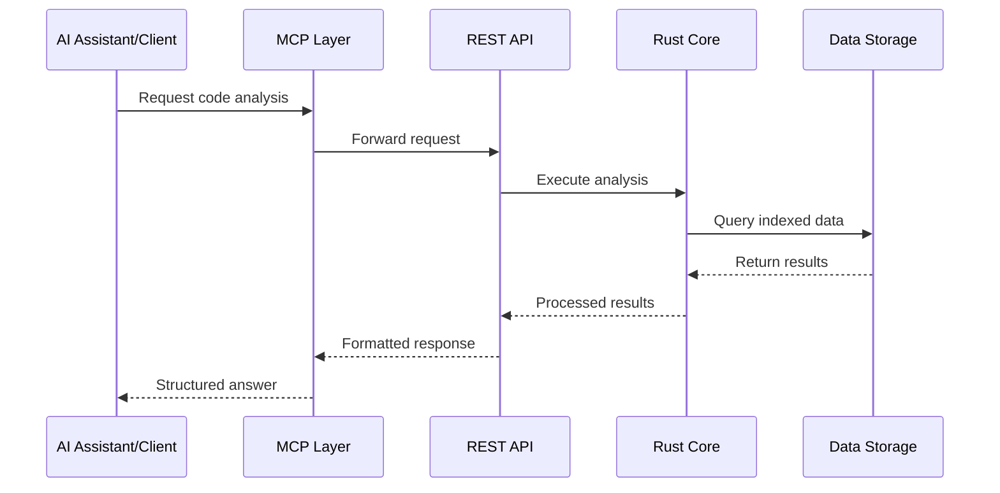

# Introduction

Welcome to the Code Intelligence MCP Server! This powerful platform revolutionizes how you interact with and understand your codebase by providing AI-powered code analysis, semantic search, and intelligent insights.

## What Makes It Special?

The Code Intelligence MCP Server stands out from traditional code analysis tools by combining:

- **AI-Powered Understanding**: Uses advanced language models to understand code semantics
- **Model Context Protocol**: Native integration with AI assistants like Claude
- **High-Performance Core**: Rust-based engine for lightning-fast analysis
- **Multi-Language Support**: Works across different programming languages
- **Real-Time Analysis**: Incremental indexing keeps your analysis up-to-date

## Core Components

### 🦀 **Rust Core Engine**
The heart of the system, built in Rust for maximum performance:
- **Tree-sitter Integration**: Advanced syntax parsing for multiple languages
- **Tantivy Search**: Full-text search with ranking and relevance
- **ONNX Runtime**: Machine learning inference for embeddings
- **Parallel Processing**: Multi-threaded analysis for large codebases

### 🔧 **TypeScript MCP Layer**
Provides the Model Context Protocol interface:
- **Tool Definitions**: Standardized tools for code analysis
- **Request Handling**: Manages communication with AI assistants
- **Response Formatting**: Structures results for optimal AI consumption
- **Error Management**: Robust error handling and recovery

### 🌐 **REST API Gateway**
Flexible HTTP interface for any client:
- **OpenAPI Specification**: Well-documented API endpoints
- **Authentication**: Secure API key-based access
- **Rate Limiting**: Prevents abuse and ensures fair usage
- **Monitoring**: Built-in metrics and health checks

## How It Works



### The Analysis Pipeline

1. **Code Ingestion**: Your codebase is scanned and parsed
2. **Syntax Analysis**: Tree-sitter extracts structural information
3. **Semantic Processing**: Code entities and relationships are identified
4. **Embedding Generation**: Vector representations for semantic search
5. **Index Storage**: Optimized storage for fast retrieval
6. **Query Processing**: Real-time search and analysis requests

## Supported Languages

The server supports analysis for multiple programming languages:

| Language | Parsing | Semantic Analysis | Embedding Support |
|----------|---------|-------------------|-------------------|
| TypeScript | ✅ | ✅ | ✅ |
| JavaScript | ✅ | ✅ | ✅ |
| Python | ✅ | ✅ | ✅ |
| Rust | ✅ | ✅ | ✅ |
| Java | ✅ | ✅ | ✅ |
| C++ | ✅ | ⚠️ | ✅ |
| Go | ✅ | ⚠️ | ✅ |
| C# | ✅ | ⚠️ | ✅ |

*✅ Full Support, ⚠️ Partial Support*

## Key Benefits

### For Developers
- **Faster Code Discovery**: Find relevant code instantly with natural language
- **Better Understanding**: Get explanations of complex code patterns
- **Quality Insights**: Identify potential issues and improvements
- **Refactoring Support**: Understand dependencies before making changes

### For Teams
- **Knowledge Sharing**: Onboard new team members faster
- **Code Standards**: Maintain consistency across the codebase
- **Technical Debt**: Track and manage code quality over time
- **Documentation**: Auto-generate insights about code architecture

### For Organizations
- **Security Auditing**: Identify potential vulnerabilities
- **Compliance**: Ensure coding standards and best practices
- **Productivity**: Reduce time spent on code exploration
- **Quality Metrics**: Measure and improve code quality

## Use Case Examples

### 🔍 **Code Discovery**
```
Query: "Find all functions that handle user authentication"
Result: Semantic search returns relevant auth functions with context
```

### 🛡️ **Security Analysis**
```
Query: "Check for potential SQL injection vulnerabilities"
Result: Identifies risky database query patterns
```

### 📊 **Code Quality**
```
Query: "Show me the most complex functions in the codebase"
Result: Complexity analysis with refactoring suggestions
```

### 🔄 **Refactoring Support**
```
Query: "What would break if I change this function signature?"
Result: Impact analysis showing all affected code
```

## Integration Ecosystem

The Code Intelligence MCP Server integrates with your existing development workflow:

- **🤖 AI Assistants**: Claude Desktop, ChatGPT, and other MCP-compatible tools
- **📝 IDEs**: VS Code extension for in-editor analysis
- **🔄 CI/CD**: Automated code quality checks in your pipeline
- **📊 Monitoring**: Integration with observability platforms
- **🛠️ Custom Tools**: REST API for building your own integrations

## Performance Characteristics

- **Indexing Speed**: ~1000 files per second (typical TypeScript project)
- **Query Response**: <100ms for most searches
- **Memory Usage**: ~50MB base + ~1MB per 1000 files indexed
- **Storage**: ~10KB per file for full analysis data
- **Concurrent Users**: Supports 100+ simultaneous queries

## Next Steps

Ready to get started? Here's your path forward:

1. **[Installation](installation)** - Set up the server on your system
2. **[Quick Start](quick-start)** - Index your first codebase in minutes
3. **[Configuration](configuration)** - Customize the server for your needs
4. **[Integration Guides](../integration/claude-desktop)** - Connect with your tools

---

**Questions?** Check out our [troubleshooting guide](../troubleshooting/common-issues) or join the [community discussions](https://github.com/your-org/code-intelligence-mcp/discussions).