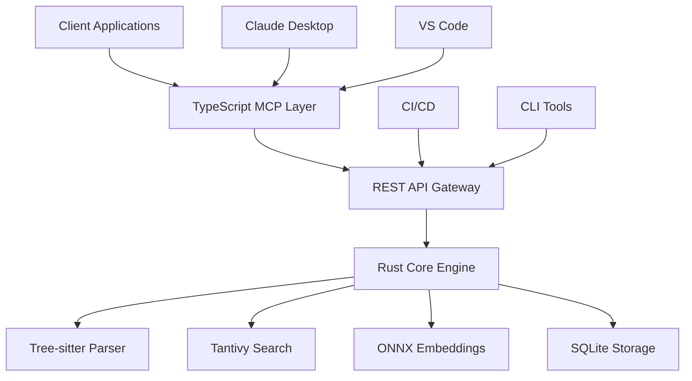

# Code Intelligence MCP Server

Welcome to the **Code Intelligence MCP Server** documentation! This comprehensive guide will help you understand, install, configure, and use our powerful code analysis and search platform.

## What is Code Intelligence MCP Server?

Code Intelligence MCP Server is a high-performance, AI-powered code analysis platform that implements the **Model Context Protocol (MCP)** for seamless integration with AI assistants and development tools. It provides:

- 🔍 **Semantic Code Search**: Find code using natural language queries
- 🏗️ **Advanced Code Analysis**: Extract functions, classes, dependencies, and relationships
- 🛡️ **Security Auditing**: Identify potential vulnerabilities and security issues
- 🚀 **Performance Optimization**: Analyze code complexity and suggest improvements
- 🔄 **Real-time Indexing**: Keep your codebase analysis up-to-date
- 🌐 **Multi-language Support**: Works with TypeScript, JavaScript, Python, Rust, and more

## Key Features

### 🎯 **Intelligent Search**
- **Keyword Search**: Fast, precise text-based search
- **Semantic Search**: Natural language understanding for complex queries
- **Hybrid Search**: Combines multiple search strategies for optimal results
- **Context-aware Results**: Provides relevant code snippets with surrounding context

### 🔧 **Code Analysis Tools**
- **Function Explanation**: Get detailed explanations of code functionality
- **Reference Finding**: Trace usage and dependencies across your codebase
- **Data Flow Tracing**: Follow variable and data transformations
- **Complexity Analysis**: Measure and optimize code complexity
- **Duplicate Detection**: Identify and eliminate code duplication

### 🛠️ **Developer Integration**
- **Claude Desktop**: Native integration with Anthropic's Claude
- **VS Code Extension**: Seamless IDE integration
- **CI/CD Pipeline**: Automated code analysis in your build process
- **REST API**: Flexible integration with any development tool
- **Command Line Interface**: Powerful CLI for automation and scripting

### ⚡ **Performance & Scalability**
- **Rust Core**: High-performance indexing and search engine
- **Parallel Processing**: Multi-threaded analysis for large codebases
- **Incremental Indexing**: Only process changed files
- **Caching System**: Intelligent query caching for faster responses
- **Memory Optimization**: Efficient memory usage for large projects

## Architecture Overview



## Quick Start

Get up and running in minutes:

```bash
# Install via npm
npm install -g code-intelligence-mcp

# Initialize a new project
code-intel init my-project

# Index your codebase
code-intel index /path/to/your/code

# Start the server
code-intel serve
```

## Use Cases

### 🤖 **AI Assistant Integration**
Enhance your AI coding assistant with deep codebase understanding:
- Answer questions about your code architecture
- Suggest improvements and refactoring opportunities
- Explain complex code patterns and relationships
- Generate documentation from code analysis

### 🔍 **Code Discovery**
Quickly find what you're looking for in large codebases:
- "Find all authentication-related functions"
- "Show me how user data flows through the system"
- "Locate all API endpoints that handle payments"
- "Find similar code patterns across the project"

### 🛡️ **Security & Quality**
Maintain code quality and security standards:
- Identify potential security vulnerabilities
- Detect code smells and anti-patterns
- Monitor code complexity trends
- Ensure consistent coding standards

### 📊 **Code Analytics**
Gain insights into your codebase:
- Track code complexity over time
- Identify refactoring opportunities
- Measure technical debt
- Analyze dependency relationships

## Getting Help

- 📖 **Documentation**: Browse our comprehensive guides
- 💬 **Community**: Join our [GitHub Discussions](https://github.com/your-org/code-intelligence-mcp/discussions)
- 🐛 **Issues**: Report bugs on [GitHub Issues](https://github.com/your-org/code-intelligence-mcp/issues)
- 💡 **Feature Requests**: Suggest new features in our discussions

## What's Next?

1. **[Installation Guide](getting-started/installation)** - Set up the server on your system
2. **[Quick Start Tutorial](getting-started/quick-start)** - Index your first codebase
3. **[Integration Guides](integration/claude-desktop)** - Connect with your favorite tools
4. **[API Reference](api/rest-endpoints)** - Explore the full API capabilities

---

**Ready to supercharge your code analysis?** Let's get started with the [installation guide](getting-started/installation)!