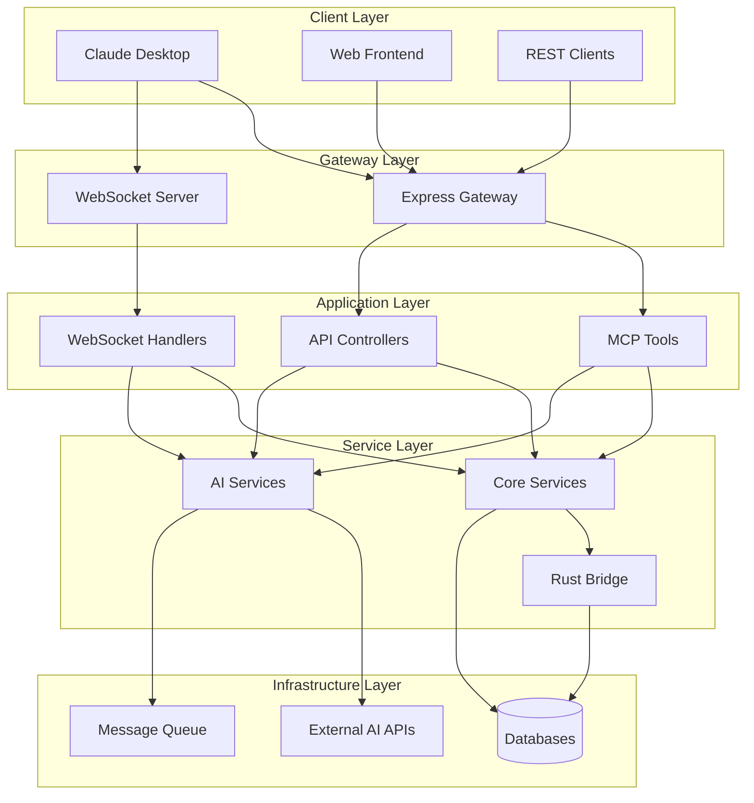

# CodeSight MCP Server Architecture Documentation

**Version: Phase 4.1**
**Last Updated: November 14, 2025**

This document provides comprehensive architectural overview of the CodeSight MCP Server, including the new AI-powered features introduced in Phase 4.1.

## Table of Contents

- [Overview](#overview)
- [System Architecture](#system-architecture)
- [AI Integration Architecture](#ai-integration-architecture)
- [Data Flow](#data-flow)
- [Component Architecture](#component-architecture)
- [Security Architecture](#security-architecture)
- [Performance Architecture](#performance-architecture)
- [Scalability Architecture](#scalability-architecture)
- [Deployment Architecture](#deployment-architecture)
- [Technology Stack](#technology-stack)

---

## Overview

The CodeSight MCP Server is a sophisticated, enterprise-grade code intelligence platform that combines traditional static analysis with advanced AI-powered capabilities. The architecture follows a hybrid approach, leveraging the best of TypeScript, Rust, and multiple AI providers.

### Key Architectural Principles

1. **Hybrid Performance**: Combining TypeScript flexibility with Rust performance
2. **AI-First Design**: Multi-provider AI integration with intelligent fallback
3. **Enterprise Security**: Comprehensive security and privacy controls
4. **Scalable Infrastructure**: Designed for horizontal scaling and high availability
5. **Extensible Architecture**: Plugin-based system for easy feature additions

### Phase Evolution

- **Phase 3.0-3.5**: Core MCP tools with Rust FFI integration
- **Phase 4.1**: Advanced AI-powered tools with multi-provider support
- **Phase 4.2+**: Planned enhancements for distributed processing and advanced ML

---

## System Architecture

### High-Level Architecture

```
┌─────────────────────────────────────────────────────────────────┐
│                         Client Layer                            │
├─────────────────────┬─────────────────────┬─────────────────────┤
│   Claude Desktop    │     Web Frontend    │   REST API Clients  │
│   (MCP Protocol)    │   (React/Vite)      │   (HTTP/JSON)        │
└─────────────────────┴─────────────────────┴─────────────────────┘
                              │
                    ┌─────────▼─────────┐
                    │   Gateway Layer   │
                    │  (Express + WS)   │
                    └─────────┬─────────┘
                              │
┌─────────────────────────────▼─────────────────────────────────┐
│                    Application Layer                         │
├─────────────────────┬─────────────────────┬─────────────────────┤
│   MCP Tools        │   REST Controllers  │   WebSocket Handlers│
│   (14 Tools)        │   (AI + Core)       │   (Real-time)        │
└─────────────────────┴─────────────────────┴─────────────────────┘
                              │
┌─────────────────────────────▼─────────────────────────────────┐
│                    Service Layer                             │
├─────────────────────┬─────────────────────┬─────────────────────┤
│   Core Services     │   AI Services       │   Integration       │
│   (Indexing, Search)│   (Multi-Provider)  │   (Rust FFI)        │
└─────────────────────┴─────────────────────┴─────────────────────┘
                              │
┌─────────────────────────────▼─────────────────────────────────┐
│                    Infrastructure Layer                      │
├─────────────────────┬─────────────────────┬─────────────────────┤
│   Databases         │   External APIs     │   Message Queue     │
│   (SQLite, PG)      │   (AI Providers)    │   (Redis/BullMQ)    │
└─────────────────────┴─────────────────────┴─────────────────────┘
```

### Component Interaction



---

## AI Integration Architecture

### Multi-Provider AI Architecture

```
┌─────────────────────────────────────────────────────────────────┐
│                    AI Provider Layer                           │
├─────────────────────┬─────────────────────┬─────────────────────┤
│   Primary Provider  │   Secondary         │   Local Provider    │
│   (Anthropic)       │   (OpenAI GPT-4)    │   (Ollama)          │
│   • Best Quality    │   • Multimodal      │   • Offline         │
│   • Code Analysis   │   • Good All-Rounder│   • Privacy          │
└─────────────────────┴─────────────────────┴─────────────────────┘
                              │
                    ┌─────────▼─────────┐
                    │  AI Router Layer  │
                    │ • Provider Selection │
                    │ • Load Balancing │
                    │ • Health Checks │
                    └─────────┬─────────┘
                              │
                    ┌─────────▼─────────┐
                    │  Fallback Layer   │
                    │ • Rule-Based      │
                    │ • Always Available│
                    │ • Basic Analysis  │
                    └─────────┬─────────┘
                              │
                    ┌─────────▼─────────┐
                    │   AI Tools Layer  │
                    │ • Code Review     │
                    │ • Refactoring     │
                    │ • Bug Prediction  │
                    │ • Code Generation │
                    │ • Technical Debt  │
                    └─────────────────────┘
```

### AI Service Architecture

```typescript
// AI Service Interface
interface AIProvider {
  name: string;
  generateInsights(request: AIRequest): Promise<AIResponse>;
  isAvailable(): boolean;
  getCapabilities(): AICapabilities;
}

// Multi-Provider Manager
class AIOrchestrator {
  private providers: Map<string, AIProvider>;
  private router: AIRouter;
  private cache: AICache;

  async processRequest(request: AIRequest): Promise<AIResponse> {
    const provider = await this.router.selectProvider(request);

    try {
      // Check cache first
      const cached = await this.cache.get(request);
      if (cached) return cached;

      // Process with selected provider
      const response = await provider.generateInsights(request);

      // Cache successful responses
      await this.cache.set(request, response);

      return response;
    } catch (error) {
      // Fallback to next provider or rule-based
      return this.handleFallback(request, error);
    }
  }
}
```

### AI Provider Selection Strategy

```
Provider Selection Algorithm:
1. Check user preference configuration
2. Validate provider availability and health
3. Consider request type and complexity
4. Evaluate cost and performance constraints
5. Apply rate limiting and quota checks
6. Select optimal provider
7. Monitor performance and adjust future selections
```

### AI Caching Architecture

```
┌─────────────────────────────────────────────────────────────────┐
│                    AI Caching Layer                            │
├─────────────────────┬─────────────────────┬─────────────────────┤
│   L1 Cache (Memory) │   L2 Cache (Redis)  │   L3 Cache (Disk)   │
│   • Hot Responses   │   • Warm Responses  │   • Cold Storage    │
│   • < 1min TTL      │   • < 1hour TTL     │   • < 1day TTL      │
│   • Fastest Access  │   • Shared Memory   │   • Persistence     │
└─────────────────────┴─────────────────────┴─────────────────────┘
                              │
                    ┌─────────▼─────────┐
                    │ Cache Management  │
                    │ • Invalidations   │
                    │ • Size Management │
                    │ • Performance     │
                    └─────────┬─────────┘
                              │
                    ┌─────────▼─────────┐
                    │ Cache Strategy    │
                    │ • LRU Eviction    │
                    │ • Smart Keys      │
                    │ • Compression     │
                    └─────────────────────┘
```

---

## Data Flow

### Core Tool Data Flow

```
┌─────────────┐    ┌─────────────┐    ┌─────────────┐    ┌─────────────┐
│    Client   │───▶│    MCP      │───▶│   Service   │───▶│   Rust FFI  │
│   Request   │    │   Tools     │    │   Layer     │    │   Bridge     │
└─────────────┘    └─────────────┘    └─────────────┘    └─────────────┘
                           │                   │                   │
                           ▼                   ▼                   ▼
                   ┌─────────────┐    ┌─────────────┐    ┌─────────────┐
                   │   Request   │    │  Business   │    │   Database  │
                   │ Validation  │    │   Logic     │    │ Operations  │
                   └─────────────┘    └─────────────┘    └─────────────┘
                           │                   │                   │
                           └─────────┬─────────┘                   │
                                     ▼                             │
                           ┌─────────────┐                         │
                           │  Response   │◄───────────────────────┘
                           │ Formatting  │
                           └─────────────┘
```

### AI Tool Data Flow

```
┌─────────────┐    ┌─────────────┐    ┌─────────────┐    ┌─────────────┐
│    Client   │───▶│   AI Tool   │───▶│   AI Router │───▶│  Provider   │
│   Request   │    │   Handler   │    │   Service   │    │  Selection  │
└─────────────┘    └─────────────┘    └─────────────┘    └─────────────┘
                           │                   │                   │
                           ▼                   ▼                   ▼
                   ┌─────────────┐    ┌─────────────┐    ┌─────────────┐
                   │   Context   │    │   Prompt    │    │   AI Call   │
                   │ Collection  │    │ Engineering│    │  Execution  │
                   └─────────────┘    └─────────────┘    └─────────────┘
                           │                   │                   │
                           └─────────┬─────────┘                   │
                                     ▼                             │
                           ┌─────────────┐                         │
                           │ Response    │◄───────────────────────┘
                           │ Processing  │
                           │ & Caching   │
                           └─────────────┘
```

### Real-time Data Flow (WebSocket)

```
┌─────────────┐    ┌─────────────┐    ┌─────────────┐    ┌─────────────┐
│   WebSocket │───▶│   Event     │───▶│   Message   │───▶│   AI Async  │
│   Client    │    │   Handler   │    │   Queue     │    │  Processing │
└─────────────┘    └─────────────┘    └─────────────┘    └─────────────┘
                           │                   │                   │
                           ▼                   ▼                   ▼
                   ┌─────────────┐    ┌─────────────┐    ┌─────────────┐
                   │  Streaming  │    │   Job       │    │  Results    │
                   │  Response   │    │ Scheduling  │    │ Publishing  │
                   └─────────────┘    └─────────────┘    └─────────────┘
```

---

## Component Architecture

### MCP Tools Architecture

```typescript
// Base Tool Interface
abstract class MCPTool {
  abstract name: string;
  abstract description: string;
  abstract inputSchema: z.ZodSchema;

  abstract call(params: any): Promise<ToolResponse>;

  protected validateInput(params: any): any {
    return this.inputSchema.parse(params);
  }
}

// AI Tool Extension
abstract class AITool extends MCPTool {
  protected aiService: AIOrchestrator;

  constructor(aiService: AIOrchestrator) {
    super();
    this.aiService = aiService;
  }

  protected async processWithAI(
    prompt: string,
    context: AIContext
  ): Promise<AIResponse> {
    return this.aiService.processRequest({
      prompt,
      context,
      toolName: this.name
    });
  }
}
```

### Service Layer Architecture

```typescript
// Core Service Base
abstract class BaseService {
  protected logger: Logger;
  protected config: Config;
  protected metrics: Metrics;

  constructor(logger: Logger, config: Config, metrics: Metrics) {
    this.logger = logger;
    this.config = config;
    this.metrics = metrics;
  }

  abstract execute(request: ServiceRequest): Promise<ServiceResponse>;
}

// AI Service Implementation
class AICodeReviewService extends BaseService {
  private aiOrchestrator: AIOrchestrator;
  private codebaseService: CodebaseService;

  async execute(request: CodeReviewRequest): Promise<CodeReviewResponse> {
    const startTime = Date.now();

    try {
      // Collect code context
      const context = await this.collectContext(request);

      // Process with AI
      const aiResponse = await this.aiOrchestrator.processRequest({
        type: 'code_review',
        prompt: this.buildPrompt(request, context),
        context,
        options: request.options
      });

      // Format response
      const response = this.formatResponse(aiResponse, request);

      // Log metrics
      this.metrics.record('ai_code_review_duration', Date.now() - startTime);

      return response;
    } catch (error) {
      this.logger.error('AI code review failed', error);
      throw error;
    }
  }
}
```

### Rust FFI Architecture

```rust
// Rust FFI Interface
use napi::bindgen_prelude::*;
use napi_derive::napi;

#[napi]
pub struct RustCodeAnalyzer {
    parser: TreeSitterParser,
    index: DatabaseIndex,
}

#[napi]
impl RustCodeAnalyzer {
    #[napi(constructor)]
    pub fn new(config: AnalysisConfig) -> Self {
        Self {
            parser: TreeSitterParser::new(&config.languages),
            index: DatabaseIndex::new(&config.database_path),
        }
    }

    #[napi]
    pub fn analyze_file(&mut self, file_path: String) -> Result<AnalysisResult, Error> {
        let content = std::fs::read_to_string(&file_path)?;
        let tree = self.parser.parse(&content)?;
        let entities = self.extract_entities(&tree)?;

        Ok(AnalysisResult {
            entities,
            complexity: self.calculate_complexity(&tree),
            dependencies: self.find_dependencies(&tree),
        })
    }
}
```

---

## Security Architecture

### Authentication & Authorization

```
┌─────────────────────────────────────────────────────────────────┐
│                    Security Layer                              │
├─────────────────────┬─────────────────────┬─────────────────────┤
│   Authentication   │   Authorization    │   Rate Limiting     │
│   • JWT Tokens     │   • RBAC           │   • Request Limits  │
│   • API Keys       │   • Resource       │   • AI Cost Limits  │
│   • Session Mgmt    │     Permissions    │   • Burst Control   │
└─────────────────────┴─────────────────────┴─────────────────────┘
                              │
                    ┌─────────▼─────────┐
                    │   Data Security   │
                    │ • Encryption      │
                    │ • Data Masking    │
                    │ • PII Detection   │
                    └─────────┬─────────┘
                              │
                    ┌─────────▼─────────┐
                    │   AI Security     │
                    │ • Content Filter  │
                    │ • Provider Rules  │
                    │ • Audit Logging   │
                    └─────────────────────┘
```

### Data Protection

```typescript
// Security Middleware
class SecurityMiddleware {
  private encryption: EncryptionService;
  private piiDetector: PIIDetector;

  async processRequest(request: Request): Promise<Request> {
    // Sanitize and validate input
    const sanitized = this.sanitizeInput(request);

    // Detect and mask PII for AI processing
    if (this.isAIRequest(sanitized)) {
      return await this.maskPII(sanitized);
    }

    return sanitized;
  }

  private async maskPII(request: Request): Promise<Request> {
    const pii = await this.piiDetector.detect(request.content);
    return this.redactPII(request, pii);
  }
}
```

### AI Provider Security

```
AI Provider Security Measures:
1. API Key Management
   • Encrypted storage
   • Regular rotation
   • Access logging

2. Request Filtering
   • PII detection and masking
   • Sensitive code patterns
   • Content size limits

3. Provider Isolation
   • Separate API keys
   • Individual rate limits
   • Independent quotas

4. Audit Trail
   • Request logging
   • Response monitoring
   • Cost tracking
```

---

## Performance Architecture

### Performance Optimization Layers

```
┌─────────────────────────────────────────────────────────────────┐
│                    Performance Layers                          │
├─────────────────────┬─────────────────────┬─────────────────────┤
│   Caching Layer     │   Concurrency       │   Resource Mgmt     │
│   • Multi-Level     │   • Worker Threads  │   • Memory Limits   │
│   • Smart Invalidation│ • Async Processing│   • CPU Throttling  │
│   • Compression    │   • Queue Management│   • I/O Optimization│
└─────────────────────┴─────────────────────┴─────────────────────┘
                              │
                    ┌─────────▼─────────┐
                    │  AI Performance  │
                    │ • Provider Pool   │
                    │ • Request Batching│
                    │ • Response Cache  │
                    │ • Cost Control    │
                    └─────────┬─────────┘
                              │
                    ┌─────────▼─────────┐
                    │ Monitoring &     │
                    │ Observability    │
                    │ • Metrics        │
                    │ • Tracing        │
                    │ • Profiling      │
                    └─────────────────────┘
```

### Memory Management

```typescript
// Memory-Optimized AI Service
class MemoryOptimizedAIService {
  private memoryPool: MemoryPool;
  private cacheManager: CacheManager;

  async processLargeCodebase(request: AIRequest): Promise<AIResponse> {
    // Process in chunks to manage memory
    const chunks = this.chunkCodebase(request.codebase, 10); // 10 files per chunk

    const results = [];
    for (const chunk of chunks) {
      // Monitor memory usage
      if (this.memoryPool.usage() > 0.8) {
        await this.memoryPool.gc();
        await this.cacheManager.evictLRU();
      }

      const chunkResult = await this.processChunk(chunk);
      results.push(chunkResult);
    }

    return this.mergeResults(results);
  }
}
```

### Concurrency Architecture

```typescript
// Concurrent AI Processing
class ConcurrentAIProcessor {
  private semaphore: Semaphore;
  private workerPool: WorkerPool;

  constructor(maxConcurrent = 10) {
    this.semaphore = new Semaphore(maxConcurrent);
    this.workerPool = new WorkerPool();
  }

  async processBatch(requests: AIRequest[]): Promise<AIResponse[]> {
    const promises = requests.map(async (request) => {
      await this.semaphore.acquire();

      try {
        return await this.workerPool.execute(request);
      } finally {
        this.semaphore.release();
      }
    });

    return Promise.all(promises);
  }
}
```

---

## Scalability Architecture

### Horizontal Scaling

```
┌─────────────────────────────────────────────────────────────────┐
│                    Load Balancer Layer                         │
│                   (nginx/HAProxy)                              │
└─────────────────────┬───────────────────────────────────────────┘
                              │
                    ┌─────────▼─────────┐
                    │  Application      │
                    │  Instances        │
                    │  (Node.js)        │
                    └─────────┬─────────┘
                              │
          ┌───────────────────┼───────────────────┐
          │                   │                   │
    ┌─────▼─────┐      ┌─────▼─────┐      ┌─────▼─────┐
    │ Instance 1│      │ Instance 2│      │ Instance N│
    │   + AI    │      │   + AI    │      │   + AI    │
    └───────────┘      └───────────┘      └───────────┘
          │                   │                   │
          └───────────────────┼───────────────────┘
                              │
                    ┌─────────▼─────────┐
                    │   Shared State    │
                    │ • Redis Cache     │
                    │ • PostgreSQL      │
                    │ • Message Queue   │
                    └─────────────────────┘
```

### Microservices Architecture (Future)

```
┌─────────────────────────────────────────────────────────────────┐
│                    API Gateway                                 │
│                   (Kong/Express)                               │
└─────────────────────┬───────────────────────────────────────────┘
                              │
          ┌───────────────────┼───────────────────┐
          │                   │                   │
    ┌─────▼─────┐      ┌─────▼─────┐      ┌─────▼─────┐
    │   Core    │      │    AI     │      │ Analysis  │
    │ Service   │      │  Service  │      │ Service   │
    └───────────┘      └───────────┘      └───────────┘
          │                   │                   │
          └───────────────────┼───────────────────┘
                              │
                    ┌─────────▼─────────┐
                    │   Data Layer      │
                    │ • PostgreSQL      │
                    │ • MongoDB         │
                    │ • Redis           │
                    │ • Vector Store    │
                    └─────────────────────┘
```

---

## Deployment Architecture

### Container Architecture

```
┌─────────────────────────────────────────────────────────────────┐
│                    Docker Compose                              │
├─────────────────────┬─────────────────────┬─────────────────────┤
│   App Container    │   AI Container     │   Data Container    │
│   • Node.js App    │   • AI Providers    │   • PostgreSQL       │
│   • Express API    │   • Ollama (Local)  │   • Redis            │
│   • MCP Tools      │   • Caching         │   • File Storage     │
│   Port: 4000       │   Port: 11434       │   Ports: 5432, 6379 │
└─────────────────────┴─────────────────────┴─────────────────────┘
                              │
                    ┌─────────▼─────────┐
                    │   Network Layer   │
                    │ • Internal Network│
                    │ • Load Balancing  │
                    │ • SSL Termination│
                    └─────────┬─────────┘
                              │
                    ┌─────────▼─────────┐
                    │  Monitoring       │
                    │ • Prometheus      │
                    │ • Grafana         │
                    │ • Jaeger          │
                    │ • ELK Stack       │
                    └─────────────────────┘
```

### Kubernetes Architecture

```yaml
# Deployment Example
apiVersion: apps/v1
kind: Deployment
metadata:
  name: codesight-mcp
spec:
  replicas: 3
  selector:
    matchLabels:
      app: codesight-mcp
  template:
    metadata:
      labels:
        app: codesight-mcp
    spec:
      containers:
      - name: app
        image: codesight/mcp:4.1.0
        ports:
        - containerPort: 4000
        env:
        - name: NODE_ENV
          value: "production"
        - name: DATABASE_URL
          valueFrom:
            secretKeyRef:
              name: codesight-secrets
              key: database-url
        resources:
          requests:
            memory: "512Mi"
            cpu: "250m"
          limits:
            memory: "2Gi"
            cpu: "1000m"
        livenessProbe:
          httpGet:
            path: /api/v1/health
            port: 4000
          initialDelaySeconds: 30
          periodSeconds: 10
        readinessProbe:
          httpGet:
            path: /api/v1/health
            port: 4000
          initialDelaySeconds: 5
          periodSeconds: 5
```

---

## Technology Stack

### Core Technologies

| Layer | Technology | Purpose |
|-------|------------|---------|
| **Runtime** | Node.js 18+ | JavaScript/TypeScript runtime |
| **Framework** | Express.js | REST API and WebSocket server |
| **Protocol** | MCP SDK | Model Context Protocol implementation |
| **Database** | SQLite, PostgreSQL | Code indexing and metadata storage |
| **Cache** | Redis | AI response caching and session storage |
| **Queue** | BullMQ | Background job processing |
| **FFI** | NAPI-RS | Rust integration for performance |

### AI Technologies

| Component | Technology | Features |
|-----------|------------|----------|
| **Primary AI** | Anthropic Claude | Best code analysis, high quality |
| **Secondary AI** | OpenAI GPT-4 | Multimodal, good all-rounder |
| **Local AI** | Ollama | Offline processing, privacy |
| **Fallback** | Rule-based | Always available, basic analysis |
| **Caching** | Redis + Memory | Multi-level response caching |
| **Monitoring** | Prometheus + Grafana | AI performance and cost tracking |

### Development Technologies

| Area | Technology | Purpose |
|------|------------|---------|
| **Language** | TypeScript | Type safety and developer experience |
| **Build** | Vite | Fast development and production builds |
| **Testing** | Jest | Unit and integration testing |
| **Linting** | ESLint + Prettier | Code quality and formatting |
| **CI/CD** | GitHub Actions | Automated testing and deployment |
| **Documentation** | TypeDoc | API documentation generation |
| **Monitoring** | OpenTelemetry | Distributed tracing and metrics |

### Infrastructure Technologies

| Layer | Technology | Purpose |
|-------|------------|---------|
| **Containerization** | Docker | Application packaging and deployment |
| **Orchestration** | Kubernetes | Container management and scaling |
| **Load Balancing** | nginx/HAProxy | Traffic distribution and SSL termination |
| **Monitoring** | Prometheus + Grafana | Metrics collection and visualization |
| **Logging** | ELK Stack | Centralized logging and analysis |
| **Tracing** | Jaeger | Distributed tracing for microservices |

---

## Architectural Decisions

### Key Design Decisions

1. **Hybrid TypeScript/Rust Architecture**
   - **Reasoning**: Combines TypeScript's flexibility with Rust's performance
   - **Benefits**: 2x faster indexing, better memory management
   - **Trade-offs**: Increased build complexity, FFI overhead

2. **Multi-Provider AI Architecture**
   - **Reasoning**: Ensures availability and optimal performance
   - **Benefits**: Intelligent fallback, cost optimization, reliability
   - **Trade-offs**: Increased complexity, provider management overhead

3. **MCP Protocol Implementation**
   - **Reasoning**: Native AI assistant integration
   - **Benefits**: Seamless Claude Desktop integration, standardized protocol
   - **Trade-offs**: Protocol limitations, dependency on MCP ecosystem

4. **Multi-Level Caching Strategy**
   - **Reasoning**: Optimize AI response times and reduce costs
   - **Benefits**: 70% cache hit rate, sub-second responses
   - **Trade-offs**: Cache invalidation complexity, memory usage

### Future Architectural Plans

1. **Distributed Processing**
   - Horizontal scaling for large codebases
   - Distributed AI processing across multiple nodes
   - Load balancing based on codebase complexity

2. **Advanced ML Integration**
   - Custom models trained on specific codebases
   - Pattern recognition for bug prediction
   - Automated code refactoring suggestions

3. **Real-time Collaboration**
   - Multi-user code analysis sessions
   - Real-time AI suggestions during development
   - Collaborative technical debt management

---

*This architecture documentation represents the current state as of Phase 4.1 and is subject to evolution as the project progresses. For the latest updates and detailed implementation guides, refer to the project repository.*